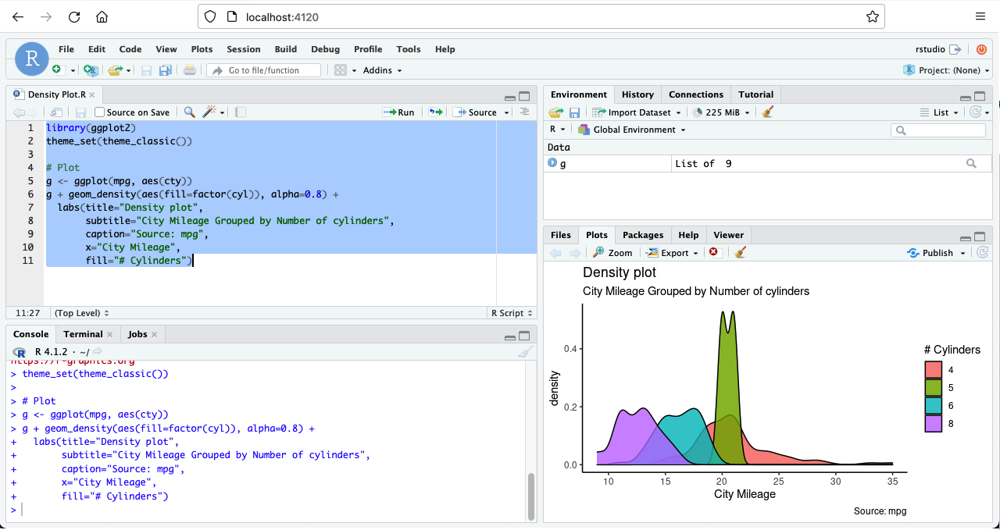
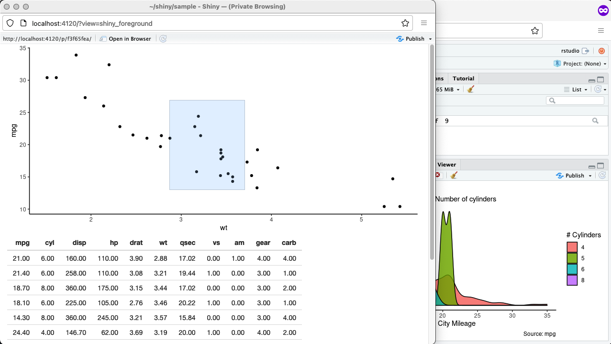
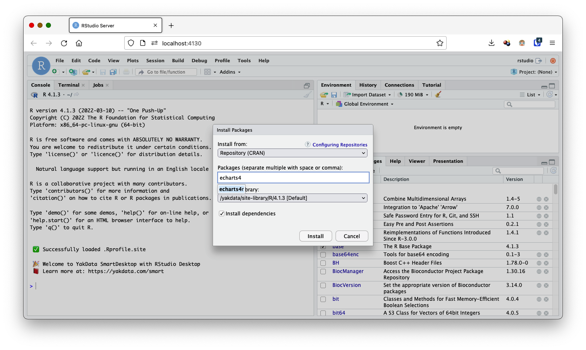

## YakData SmartDesktop with RStudio Server Open Source
The smart, portable, reproducible way to develop R programs, Shiny web apps & RMarkdown docs on your desktop. Includes R 4.1.3, the RStudio IDE, the tidyverse, verse and geospatial-related tools from the R rocker-org project as a web app. All wrapped neatly into Docker via docker-compose.

<br/>

### Apple MacBook Pro M1 Pro Chip users!
If you are using the The Apple M1 Pro Chip, this repository will not work. The M1 Pro Chip ARM64 architecture has broken underlying software used by RStudio. Please try this repository instead, https://github.com/Stephen-McDaniel/SmartDesktop-RStudio-M1-Chip-Experimental.  

<br/>


<br/><br/>
  - [🚀 Features](#-features)
  - [📷 Screenshots](#-screenshots)
  - [🧰 Install and setup](#-install-and-setup)
  - [🔒 Running this securely on a remote system](#-running-this-securely-on-a-remote-system)
  - [🔐 LICENSE](#-license)
  - [⭐ Inspiration](#-inspiration)
  - [📫 Issues](#-issues)
  - [📘 Docs](#-docs)
  - [🎡 Alternatives](#-alternatives)
  - [🧑‍💻 Discussion](#-discussion)
  - [🎉 Releases](#-releases)

## 🚀 Features

* YakData SmartDesktop with RStudio Server Open Source is the smart way to develop R programs, Shiny web apps & RMarkdown docs on your desktop. It includes R 4.1.3 from the Rocker project and the RStudio IDE as a web app all wrapped neatly into Docker.
* Save hours of time to get up and running with a complete desktop IDE for R. 
* Preloaded with the tidyverse, verse and geospatial-related tools from the R rocker-org project! Includes tex & publishing-related packages from verse.
* Designed to install packages from RStudio Package Manager on a fixed date. Easily change this in Rprofile.site. Rapid installation of most packages as this image is based on Ubuntu.
* Easy access to all the RStudio configuration and startup values.
* The end of complex uninstall/upgrade paths for R and RStudio on your laptop/desktop system. 
* Easily recreate an identical environment on another system.
* Run multiple versions of R side-by-side with multiple SmartDesktop project directories.
* Define various environments for a particular R version with multiple docker-compose files.
* Control resources used by your R sessions with docker-compose. No more system lock because an R session unexpectedly stole all your desktop resources.
* Pause and restart a long-running R session with Docker Desktop!

## 📷 Screenshots

- ggplot2 graph

<br/><br/>
- Shiny app graph brushing

<br/><br/>
- Install package to site-library<br/>

<br/><br/>
## 🧰 Install and setup

We recommend a desktop with a minimum of 1 CPU, 4 GB of RAM and at least 20 GB of free disk storage.  Your project needs may vary widely based on your apps, usage patterns and data volumes. This repository is strictly intended for local, desktop usage. The running container is not secured with encryption.

1. Install Docker and docker-compose on your system.
   a. Install Docker Desktop on Windows at https://docs.docker.com/desktop/windows/install/, or
   b. Install Docker Desktop on Mac at https://docs.docker.com/desktop/mac/install/
2. Download [this repository](https://github.com/Stephen-McDaniel/YakData-SmartDesktop-RStudio/archive/refs/tags/4.1.3.zip
   ). 
3. Unzip this repository and move it to the desired location on your computer. For example, on my Mac, it is at /Users/yakdata-stephen/Documents/Development/YakData-SmartDesktop-for-RStudio
4. Open the terminal on your computer and change directories to the install location. Now navigate one directory down to apps.
   ```cd /Users/yakdata-stephen/Documents/Development/YakData-SmartDesktop-for-RStudio```
5. With one command you will download the needed images (one time only) and start the RStudio Server. This will take a while, depending on your internet speed and your computer speed. After the first time, it will typically take 7-20 seconds to start.
   ```docker-compose up -d```
6. Check that it is running. 
   ```docker ps; ``` View the logs. 
   ```docker logs;```
7. Navigate to your new RStudio IDE from your favorite browser. 
   ```http://localhost:4120/```
8. Enjoy a portable, reproducible R experience!

Internal to Ubuntu, RStudio maps all content to **/home/rstudio**, which appears in this project tree as **/yakdata/content**.

When installing new packages from the RStudio *Packages* tab -> *Install* button, be certain to change the dropdown to the project tree location, **/yakdata/site-library/R/4.1.3**. If you don't use the docker mounted volume path, your installed libraries will disappear once you stop and restart the docker container.


## 🔒 Running this securely on a remote system

If you would like to run this on a remote server, I strongly recommend locking down all ports on your server except a port for a VPN server and a port for SSH terminal connection. Then, install a VPN server on your remote system to secure your connection from your desktop, a leading one on Github is https://hub.docker.com/r/kylemanna/openvpn  

If you use a remote server approach, we also recommend adding a password to RStudio. Change the environment section in docker-compose to replace the current setting with 
```      - PASSWORD=MyPasswordHere``` 
If you add a password, CHANGE the one on the above line. The user name for logging into the IDE is "rstudio".

An alternative remote server approach is to use the [YakData SmartManager for ShinyProxy](https://github.com/Stephen-McDaniel/SmartManager-for-ShinyProxy), which includes RStudio Server Open Source along with many other valuable systems for development and secure sharing of Shiny apps, RMarkdown documents and more.

## 🔐 LICENSE

Distributed under the Apache 2.0 license at https://apache.org/licenses/LICENSE-2.0.

RStudio is a registered trademark of RStudio, PBC. YakData is a service mark of YakData, LLC. [RStudio](https://github.com/rstudio/rstudio) products, other content from the [Rocker](https://github.com/rocker-org/rocker-versioned2) project and from CRAN are subject to other licenses which you are bound to by using these components/systems.

## ⭐ Inspiration

* RStudio Open Source Server IDE is a free, open-source IDE for R, Shiny apps and RMarkdown content.
* The RStudio Open Source Server IDE is backed by years of development, feedback and releases.
* Make it easy to create a reproducible, self-contained R development environment on any system.

If you benefit from this project, please give it a ⭐.

## 📫 Issues

Please share issues in this repository [Issues](https://github.com/Stephen-McDaniel/YakData-SmartDesktop-RStudio/issues).

## 📘 Docs

RStudio IDE repository: https://github.com/rstudio/rstudio

RStudio Package Manager: https://packagemanager.rstudio.com/client/#/

Docker Desktop: https://docs.docker.com/desktop/


## 🎡 Alternatives

Alternatives include self-install of the R, the RStudio IDE, tidyverse, verse and more directly on your OS. 

## 🧑‍💻 Discussion

Head over to [The YakData Community](https://meta.yakdata.com). You can login to comment with your Github account, a Google account or your email and a password.

## 🎉 Releases

 **4.1.3**<br>
Released March, 17th, 2022.

1) Upgrade R from 4.1.2 to **4.1.3**.
2) Make **permanent package installation the default** path for new package installs via the RStudio UI.
3) Updated the R session start messages. This is customizable in the ./yakdata/config/R/Rprofile.site file.
4) Ran tests 
Using the main repository push to Github, I downloaded the main repository zip file and ran it per the documentation.<br>
a. ✅ The R version is upgraded to 4.1.3.<br>
b. ✅ Successfully ran the R sample program. <br>
c. ✅ Successfully ran the shiny sample app, interacted with app.<br>
d. ✅ Checked that the package install works as expected, using the permanent path by default.<br>
e. ✅ Checked that session start messages work as expected.<br>

**4.1.2**

Original release in February, 2022.
